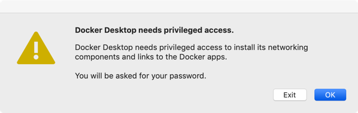

### MacOS Docker Desktop 安装使用

#### 安装

>下载链接：https://download.docker.com/mac/stable/Docker.dmg


#### 更改国内资源


- 需要输入MacBook密码


- 任务栏出现LOGO


- 查看Docker版本

````
shileideMacBook-Pro:homebrew-cask shilei$ docker --version
------------------------------
Docker version 19.03.1, build 74b1e89
````

- 国内镜像加速

> https://lug.ustc.edu.cn/wiki/mirrors/help/docker

在任务栏点击 Docker for mac 应用图标 -> Perferences... -> Daemon -> Advanced。


在列表中填写加速器地址即可。修改完成之后，点击 Apply & Restart 按钮，Docker 就会重启并应用配置的镜像地址了。

````
shileideMacBook-Pro:homebrew-cask shilei$ docker info
-----查看新的源是否正常-------------------------
......
 Insecure Registries:
  127.0.0.0/8
 Registry Mirrors:
-----跟你设置的一样就是正常-------------------------
  https://docker.mirrors.ustc.edu.cn/
 Live Restore Enabled: false
 Product License: Community Engine
````

#### 使用

- 查看当前使用的docker
````
shileideMacBook-Pro:homebrew-cask shilei$ docker ps -a 
------------------------------
CONTAINER ID        IMAGE               COMMAND             CREATED             STATUS                     PORTS               NAMES
5146a15da87f        hello-world         "/hello"            8 minutes ago       Exited (0) 8 minutes ago                       sleepy_perlman
````
- 查看当前服务器所存在的镜像
````
shileideMacBook-Pro:homebrew-cask shilei$ docker images
------------------------------
REPOSITORY          TAG                 IMAGE ID            CREATED             SIZE
hello-world         latest              fce289e99eb9        7 months ago        1.84kB
````

- 只显示容器ID
````
shileideMacBook-Pro:homebrew-cask shilei$ docker ps -aq
------------------------------   
5146a15da87f
````

- 强制批量删除容器
````
shileideMacBook-Pro:homebrew-cask shilei$ docker rm -f `docker ps -aq`
------------------------------
5146a15da87f
````

### END