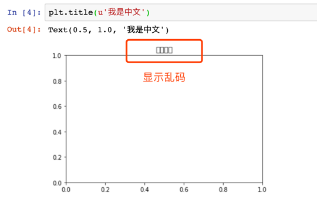
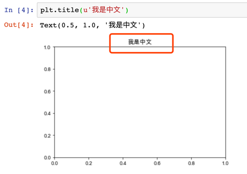

## Matplotlib 显示中文

#### 1. 绘图时title为乱码



网上有很多写法不太适用macos系统

#### 2. 实际解决办法

````
# macos 适用
------------------------------
import matplotlib.pyplot as plt
plt.rcParams['font.sans-serif'] = ['Arial Unicode MS']
plt.rcParams['axes.unicode_minus'] = False
````



## END