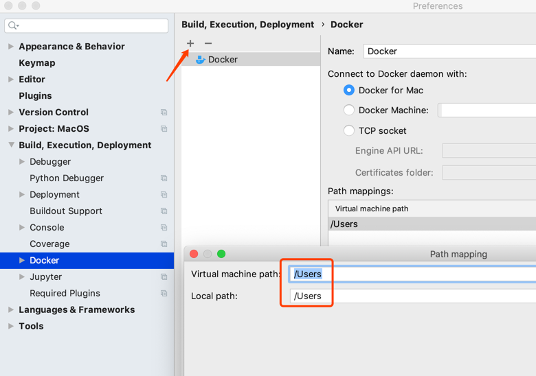

### Pycharm 使用

#### Live Templates

> 快速输入模板，Mac快捷键 "⌘J"

> 参考网址： https://www.jetbrains.com/help/pycharm/2017.1/creating-and-editing-template-variables.html

````
光标自动回到$end$地方
-----$end$-------------------------
````

#### 创建Docker环境

- 配置容器运行文件位置

````
-----先创建自己需要保存的目录-------------------------
MacBook-Pro:~ LeoShi$ mkdir Docker 
````


