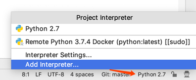
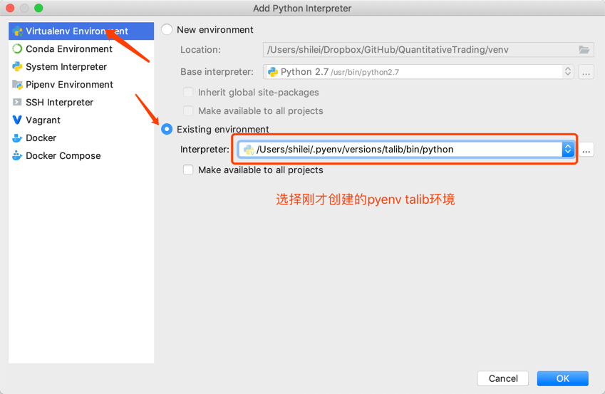

## pipenv 安装和使用

### 1. pipenv安装

#### 1.1 安装环境

````
-----操作系统版本-------------------------
$ sw_vers
ProductName:    Mac OS X
ProductVersion: 10.14.6
BuildVersion:   18G95
-----Python版本-------------------------
$ python
Python 2.7.16 (default, Sep  2 2019, 11:59:44)
-----pip版本-------------------------
$ pip -V    
pip 19.1.1 from /usr/local/lib/python2.7/site-packages/pip (python 2.7) 
````

#### 1.2 安装pipenv

- 方法一(Mac建议方法二)：
````
$ pip install --user pipenv
DEPRECATION: Python 2.7 will reach the end of its life on January 1st, 2020. Please upgrade your Python as Python 2.7 won't be maintained after that date. A future version of pip will drop support for Python 2.7.
Collecting pipenv
  Downloading https://files.pythonhosted.org/packages/bb/15/b155a5c0d19ce41609f50bb70a37e0de092b453ec4bd2eac59e53a2c3227/pipenv-2018.11.26-py2-none-any.whl (5.2MB)
     |################################| 5.2MB 7.3MB/s 
Requirement already satisfied: setuptools>=36.2.1 in /usr/local/lib/python2.7/site-packages (from pipenv) (41.0.1)
Collecting virtualenv (from pipenv)
  Downloading https://files.pythonhosted.org/packages/f7/69/1ad2d17560c4fc60170056dcd0a568b83f3453a2ac91155af746bcdb9a07/virtualenv-16.7.4-py2.py3-none-any.whl (3.3MB)
     |################################| 3.3MB 12.4MB/s 
Collecting enum34; python_version < "3" (from pipenv)
  Downloading https://files.pythonhosted.org/packages/c5/db/e56e6b4bbac7c4a06de1c50de6fe1ef3810018ae11732a50f15f62c7d050/enum34-1.1.6-py2-none-any.whl
Requirement already satisfied: pip>=9.0.1 in /usr/local/lib/python2.7/site-packages (from pipenv) (19.1.1)
Collecting typing; python_version < "3.5" (from pipenv)
  Downloading https://files.pythonhosted.org/packages/22/30/64ca29543375759dc589ade14a6cd36382abf2bec17d67de8481bc9814d7/typing-3.7.4.1-py2-none-any.whl
Collecting certifi (from pipenv)
  Downloading https://files.pythonhosted.org/packages/69/1b/b853c7a9d4f6a6d00749e94eb6f3a041e342a885b87340b79c1ef73e3a78/certifi-2019.6.16-py2.py3-none-any.whl (157kB)
     |################################| 163kB 14.8MB/s 
Collecting virtualenv-clone>=0.2.5 (from pipenv)
  Downloading https://files.pythonhosted.org/packages/ba/f8/50c2b7dbc99e05fce5e5b9d9a31f37c988c99acd4e8dedd720b7b8d4011d/virtualenv_clone-0.5.3-py2.py3-none-any.whl
Installing collected packages: virtualenv, enum34, typing, certifi, virtualenv-clone, pipenv
  WARNING: The script virtualenv is installed in '/Users/LeoShi/Library/Python/2.7/bin' which is not on PATH.
  Consider adding this directory to PATH or, if you prefer to suppress this warning, use --no-warn-script-location.
  WARNING: The script virtualenv-clone is installed in '/Users/LeoShi/Library/Python/2.7/bin' which is not on PATH.
  Consider adding this directory to PATH or, if you prefer to suppress this warning, use --no-warn-script-location.
  WARNING: The scripts pipenv and pipenv-resolver are installed in '/Users/LeoShi/Library/Python/2.7/bin' which is not on PATH.
  Consider adding this directory to PATH or, if you prefer to suppress this warning, use --no-warn-script-location.
Successfully installed certifi-2019.6.16 enum34-1.1.6 pipenv-2018.11.26 typing-3.7.4.1 virtualenv-16.7.4 virtualenv-clone-0.5.3
````

- 方法二(推荐)
````
$ brew install pyenv
$ pyenv -v    
pyenv 1.2.13
$ brew install pyenv-virtualenv

````


#### 1.3 文件安装路径

````
/Users/LeoShi/Library/Python/2.7/bin/pipenv
/Users/LeoShi/Library/Python/2.7/lib/python/site-packages/pipenv
````

#### 1.4 安装其他版本Python

````
-----国内加速-------------------------
$ v=3.5.6 && wget http://mirrors.sohu.com/python/$v/Python-$v.tar.xz -P ~/.pyenv/cache/ && pyenv install $v && rm -rf ~/.pyenv/chahe
python-build: use openssl@1.1 from homebrew
python-build: use readline from homebrew
Installing Python-3.5.6...
python-build: use readline from homebrew
python-build: use zlib from xcode sdk
Installed Python-3.5.6 to /Users/LeoShi/.pyenv/versions/3.5.6
````

# 注意

> 安装卸载任意版本必须执行如下命令

````
$ pyenv rehash
````

> 关闭当前SHELL重新开启，否则会出现无法切换环境的问题


#### 1.5 查看虚拟环境

````
-----系统的虚拟环境-------------------------
$ pyenv versions
* system (set by /Users/LeoShi/.pyenv/version)
  3.5.6
-----当前所在的环境-------------------------
$ pyenv global
system

````

#### 1.6 修改环境变量

````
$ cat ~/.bash_profile
# Setting PATH for Python 3.7
# The original version is saved in .bash_profile.pysave
# PATH="/Library/Frameworks/Python.framework/Versions/3.7/bin:${PATH}"
# export PATH
# alias python="/Library/Frameworks/Python.framework/Versions/3.7/bin/python3.7"
-----加入下面3行-------------------------
export PATH="$HOME/.pyenv/bin:$PATH"
eval "$(pyenv init -)"
eval "$(pyenv virtualenv-init -)"
````


### 2. pyenv使用

#### 2.1 Python各版本切换

> pyenv global 版本号

````
$ pyenv versions    
  system
-----*代表当前使用环境-------------------------
* 3.5.6 (set by /Users/LeoShi/.pyenv/version)
  3.7.4
-----切换-------------------------
$ pyenv global 3.7.4
-----验证-------------------------
$ python --version  
Python 3.7.4
$ pyenv versions    
  system
  3.5.6
* 3.7.4 (set by /Users/LeoShi/.pyenv/version)
````

#### 2.2 创建虚拟环境

> 默认安装路径:/Users/LeoShi/.pyenv/versions/3.5.6/envs/

````
$ pyenv virtualenv talib
Requirement already satisfied: setuptools in /Users/LeoShi/.pyenv/versions/3.5.6/envs/talib/lib/python3.5/site-packages
Requirement already satisfied: pip in /Users/LeoShi/.pyenv/versions/3.5.6/envs/talib/lib/python3.5/site-packages
````

#### 2.3 虚拟环境操作

> 激活虚拟环境：pyenv activate 环境名称
> 关闭你的虚拟环境：pyenv deactivate
> 删除你的虚拟环境：pyenv uninstall 环境名称

````
$ pyenv activate talib
-----环境变量需要增加下面的参数-------------------------
"export PYENV_VIRTUALENV_DISABLE_PROMPT=1"
pyenv-virtualenv: prompt changing will be removed from future release. configure `export PYENV_VIRTUALENV_DISABLE_PROMPT=1' to simulate the behavior.
-----验证-------------------------
$ pyenv versions
  system
  3.5.6
  3.5.6/envs/talib
  3.7.4
* talib (set by PYENV_VERSION environment variable)
````

#### 2.4 pycharm 添加虚拟环境






## END
